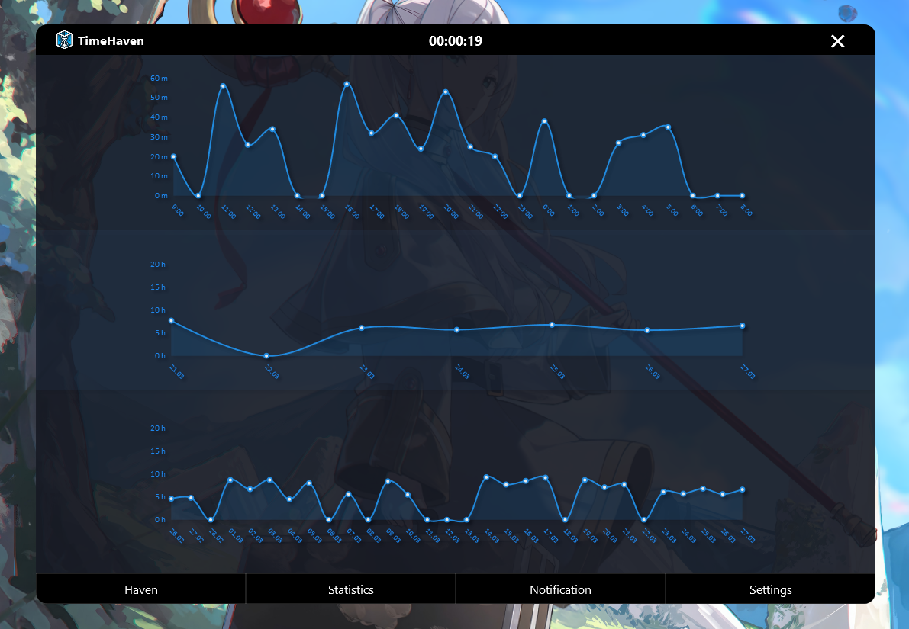
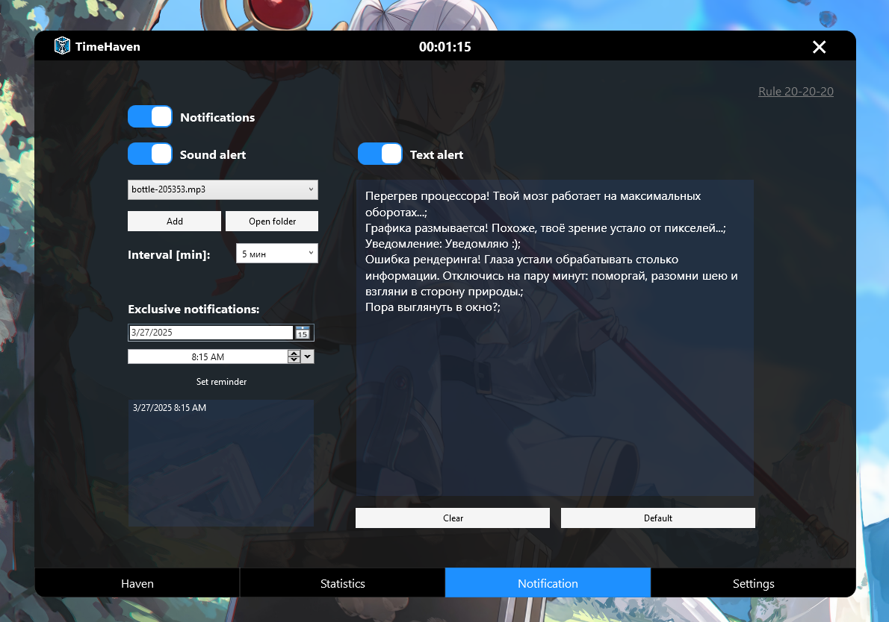
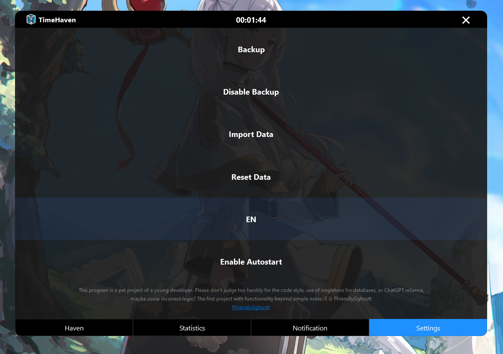
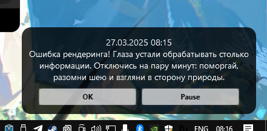

TimeHaven – Screen Time Monitoring
📊 TimeHaven is a program for tracking screen time. It helps analyze user activity, displays usage graphs, and sends notifications.

✨ Features:
✅ Screen time tracking – monitors and records computer activity
✅ App usage statistics with graphs – detailed analysis by day, week, and month
✅ Notifications for exceeding screen time limits – adjustable frequency
✅ Text and sound notifications – random or user-defined messages with audio support
✅ Custom sound support – select from standard sounds or upload your own
✅ Backup system – protects data with restore and rollback options
✅ Autostart with Windows – launches automatically on system startup
✅ Multilingual support – 🇷🇺 Russian / 🇬🇧 English (fully localized)
✅ Database integration – real-time storage and updates
✅ Flexible settings – saves all preferences (notifications, sounds, language, backup, startup) in settings.json

🚀 Installation & Launch:
⚠️ **Requirements:** TimeHaven requires **.NET 8 Runtime** to run.  
If you don’t have it installed, you can download it here:  
[Download .NET 8 Runtime](https://dotnet.microsoft.com/en-us/download/dotnet/8.0)

You can use TimeHaven in one of the following ways:

* Build manually (option to disable test database generation).
* Run the prebuilt version with test data – for a quick preview.
* Run the release version – without test data, ready for use.

📜 License
Distributed under the GNU GPL v3 license. The source code remains open and cannot be made proprietary.

👤 Author
Kostsov S.V. (FriendlyGhostt)

==================================================================================================================

TimeHaven – Мониторинг экранного времени
📊 TimeHaven – это программа для отслеживания времени за экраном. Она помогает анализировать активность пользователя, отображает графики и отправляет уведомления.

✨ Возможности:
✅ Отслеживание времени за компьютером – ведёт подробную статистику активности
✅ Графики активности – детальный анализ по приложениям за день, неделю и месяц
✅ Уведомления о превышении экранного времени – гибкая настройка периодичности
✅ Текстовые и звуковые уведомления – случайные или пользовательские сообщения с аудиосопровождением
✅ Добавление своих звуков – выбор из стандартных или загрузка собственных аудиофайлов
✅ Бэкап сохранений – защита данных с возможностью отката и восстановления
✅ Автозапуск с Windows – программа стартует автоматически при включении ПК
✅ Выбор языка – 🇷🇺 Русский / 🇬🇧 English (полная локализация)
✅ Работа с базой данных – хранение и обновление информации в реальном времени
✅ Гибкие настройки – сохранение параметров (уведомления, звуки, язык, бэкап, запуск) в settings.json

🚀 Установка и запуск:
⚠️ **Требования:** Для работы TimeHaven необходим **.NET 8 Runtime**.  
Если он не установлен, скачайте его здесь:  
[Скачать .NET 8 Runtime](https://dotnet.microsoft.com/en-us/download/dotnet/8.0)

Вы можете выбрать один из способов использования TimeHaven:

* Сборка вручную (с возможностью отключить тестовую генерацию баз данных).
* Запуск готовой сборки с тестовыми данными – для быстрого ознакомления.
* Запуск релизной версии – без тестовых данных, готовой к использованию.

📜 Лицензия
Проект распространяется по лицензии GNU GPL v3. Исходный код остается открытым, но его нельзя закрыть или сделать проприетарным.

👤 Автор
Kostsov S.V. (FriendlyGhostt)

==================================================================================================================

==================================================================================================================

📝 This project is a pet project by a beginner C# developer.
Please don’t judge too harshly for the (sometimes clumsy) code, the use of singletons, public static classes and methods, violations of OOP principles (I really tried to follow all the rules at first, but with each bug, it got harder), possibly not the most optimal logic, and, of course, relying on ChatGPT as my battle companion xD
But most importantly – this is my first project that does more than just simple notes. :3
ⓒ FriendlyGhostt

📝 Этот проект – Pet-проект начинающего C# разработчика.
Не судите строго за написание (иногда кривого) кода, использование синглтонов, публичных статических классов и методов, нарушение принципов ООП (я пытался в начале придерживаться всех правил, но с каждой ошибкой было сложнее), возможно, не самую правильную логику и, конечно же, ChatGPT в качестве боевого товарища xD 
Но, что важнее – это мой первый проект, который делает что-то большее, чем простые заметки :3
ⓒ FriendlyGhostt